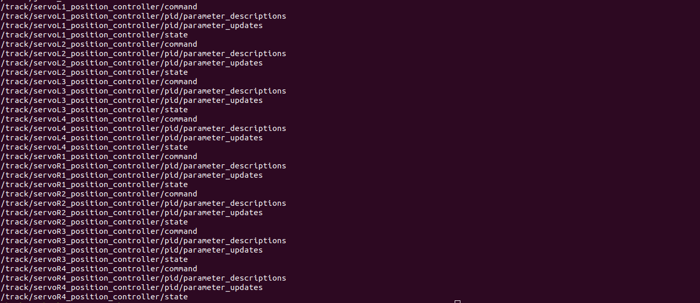

# Unmanned Hybrid Underwater Ground Vehicle

ROS-MELODIC package to simulate tracked underwater hybrid vehicle in gazebo-9

## Getting Started

Clone this repo and build it in your catkin-workspace

```
$ cd <catkin-workspace>/src
$ git clone https://github.com/shankarutthandy/uhugv.git
$ cd ..
$ catkin_make
$ source devel/setup.bash
```
## tracked vehicle simulation :

```
$ roslaunch uhugv tracks.launch 
```
>or with keyboard-teleop:
```
$ roslaunch uhugv tracks.launch teleop:=true
```


## Underwater simulation:

```
$ roslaunch uhugv uw.launch 
```


### Topics:

